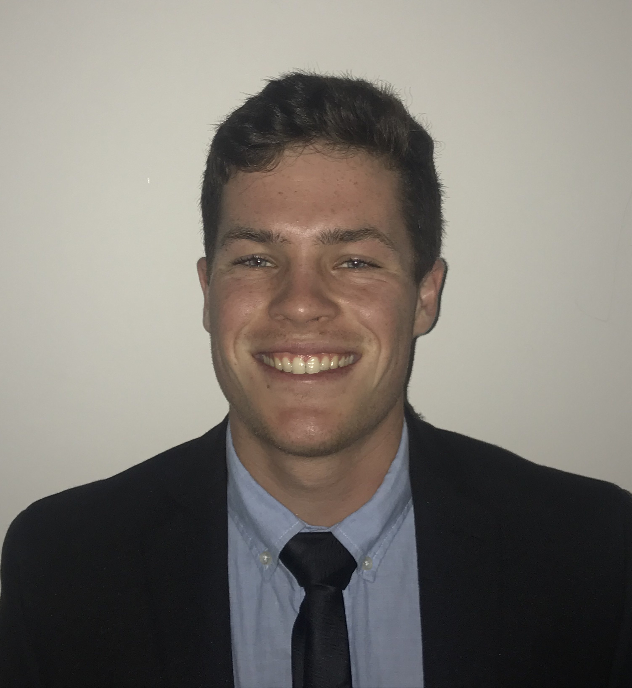

## Brice Redmond

Brice Redmond is a honors double major in Economics and Computer Science at UCSB. While he is currently looking for an internship for summer 2019 in Santa Barbara or the Bay Area, he would be interested in concurrent school internships or lab positions as well. As he is a double major in Economics and Computer Science, he is hoping to find a position in which he can combine these skills. Perhaps utilizing his computer science skills to analyze economcis concepts. In Brice's free time, you can find him working on individual projects or playing for UCSB’s ultimate frisbee team, Black Tide. On his github you can see some of the individual and group projects that he has worked on. If you wish to contact him, his email is briceredmond@gmail.com. 

   

### [LinkedIn](www.linkedin.com/in/bredmond555) [Github](https://github.com/bredmond5) [Resume](Resume_BriceRedmond.pdf) [Writing Samples](/AboutMe/Writing\ Samples)

Also put in the correct photo. 
